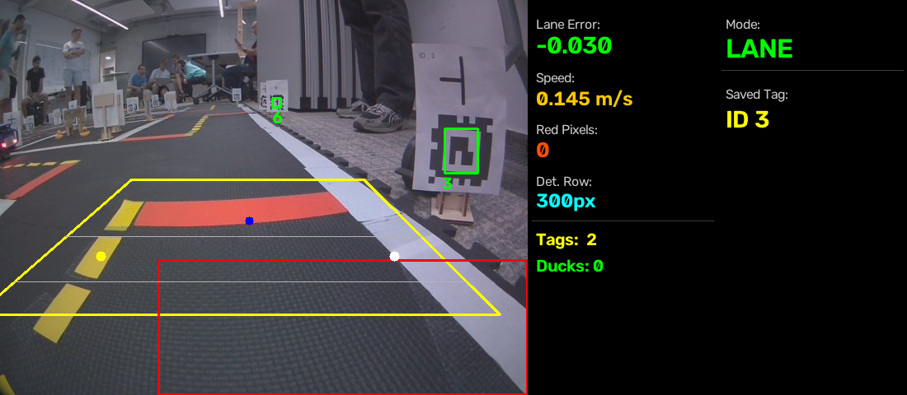
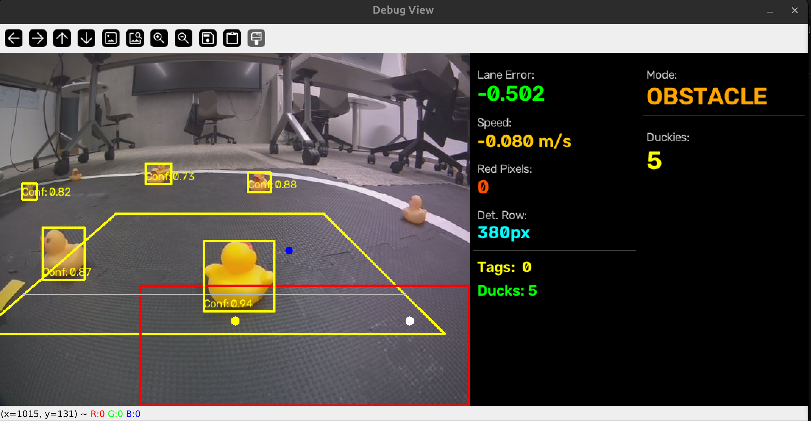
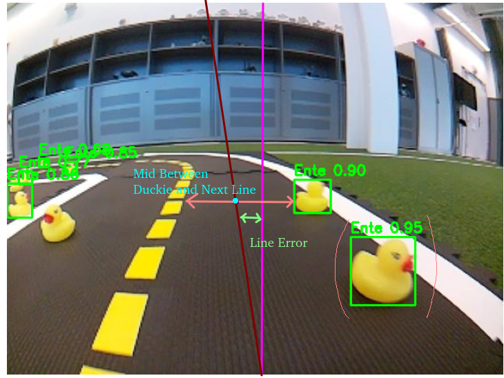
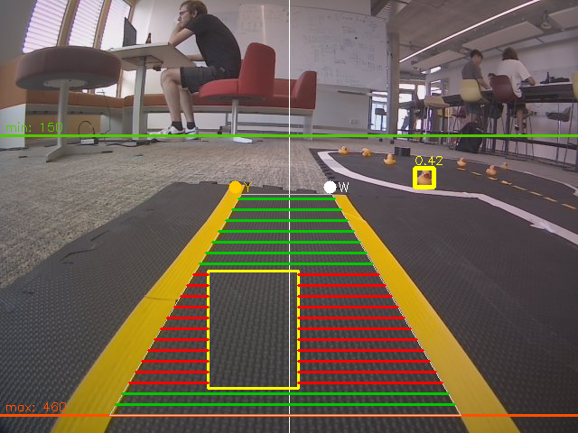
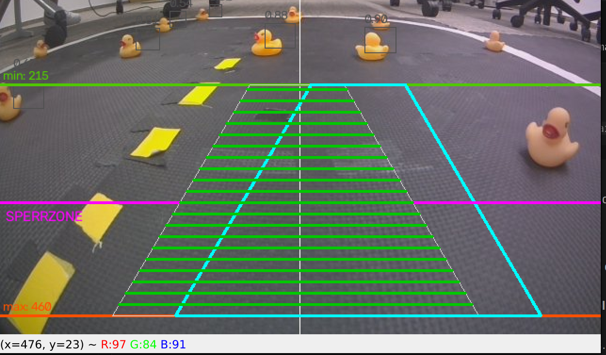
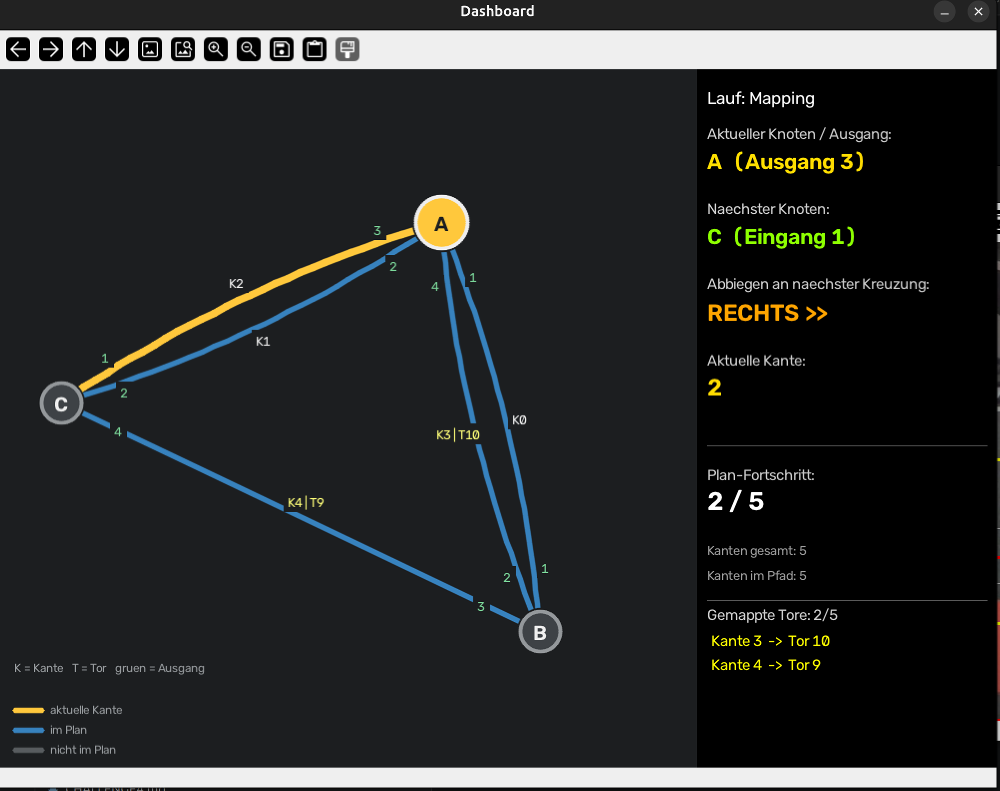
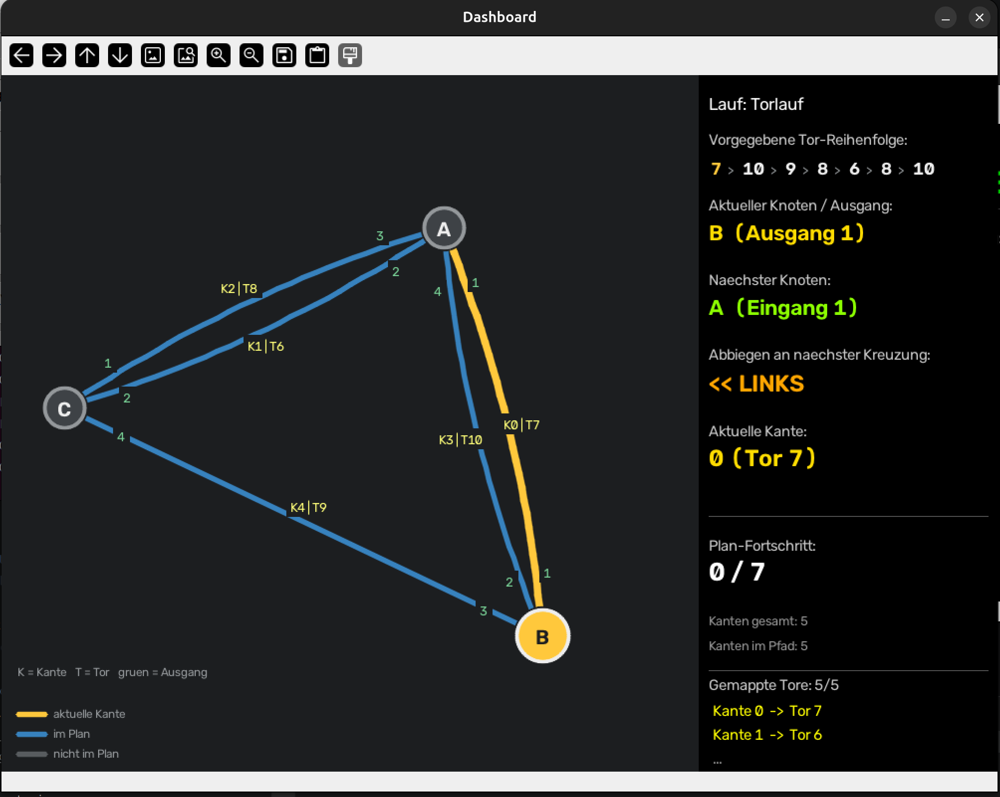
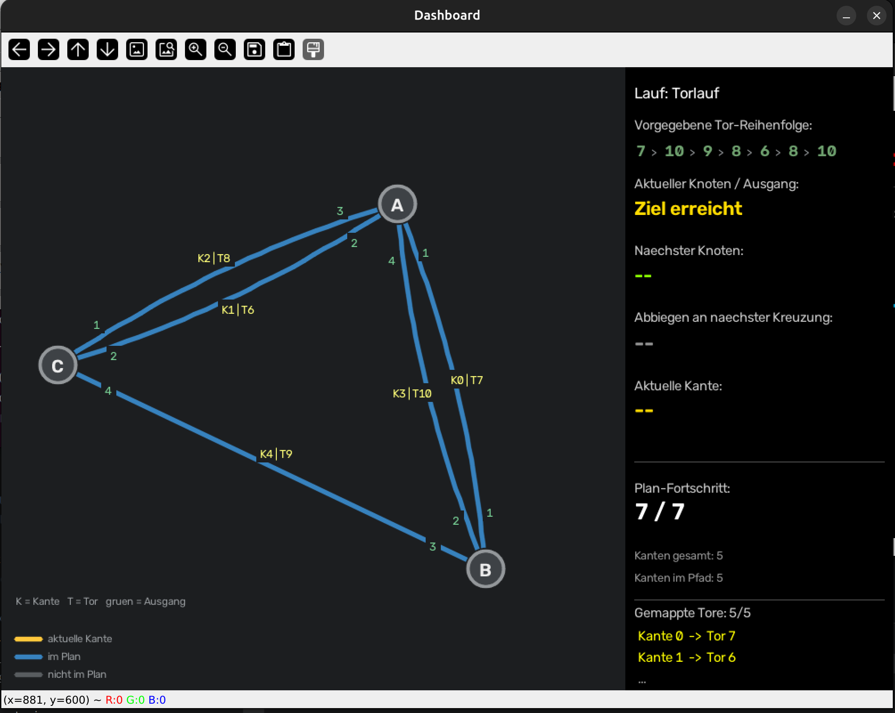

# 🦆 DuckieRace

Unser Projekt für die Duckietown-Challenges (ROS 1 Noetic, Python). Der Duckiebot
durchläuft vier aufeinander aufbauende Aufgaben, vom einfachen Spurhalten bis zum
Kartieren einer Stadt und dem Abfahren einer Torreihenfolge.

## Aufbau & Start

Das Repository ist ein **catkin-Workspace**. Der eigentliche Code liegt in
`src/packages/explore_duckietown_ii/` (das Paket `duckietown_msgs` enthält nur die
Nachrichten-Definitionen).

- **Umgebung setzen:** `source duckie-env.sh` (setzt `VEHICLE_NAME` etc.)
- **Launcher-Menü:** `bash launch.sh` wählt interaktiv einen Launcher aus `launchers/`
- Jede Challenge hat ihren eigenen Launcher (siehe unten).

### Architektur / Pipeline

Alle Nodes kommunizieren über ROS-Topics und teilen sich ein gemeinsames Muster:

- **Wahrnehmung:** `detect_lane_node`, `detect_intersection_node`, `detect_apriltag_node`,
  `detect_duckies_node`. Die Spur- und Kreuzungserkennung arbeiten auf einer per
  **perspektivischer Transformation** erzeugten **Vogelperspektive** (400x400).
- **Entscheidung:** `switch_control_node` hält den aktuellen **Modus** (`ControlType`:
  `Lane`, `Obstacle`, `Stop`, `Intersection`, `Align`) und schaltet zwischen den Verhalten um.
- **Steuerung:** `control_lane_node` erzeugt daraus das Fahrkommando (`Twist2DStamped`:
  Geschwindigkeit `v` und Drehrate `omega`).
- **Parameter** (HSV-Grenzen, PID-Werte, Schwellwerte …) liegen als JSON in `config/` und
  sind über den `configuration_node` **zur Laufzeit** einstellbar.

---

## Challenge 1: Follow Lane

**Aufgabenstellung**
- Spur erkennen: rechts weiße Linie, links gelb und gestrichelt.
- An der roten Linie 3 s anhalten.
- PID-Regler zum Steuern und Spurhalten.

**Launcher:** nicht mehr einzeln fahrbar. Challenge 1 war nur die Grundlage (reines Spurhalten
und Halten an der roten Linie); das dafür ursprünglich separate `follow_lane`-Paket wurde
entfernt. Die Spur- und Rote-Linie-Logik wird von den späteren Challenges weiterverwendet.

**Was wir gemacht haben**

*Spurerkennung (`detect_lane_node`)*

Diese Spurerkennung existierte bereits aus einem früheren Meilenstein, wir haben sie nur
leicht angepasst.

- Kamerabild wird per Perspektiv-Transformation in eine **Vogelperspektive** (400x400) gebracht.
- **HSV-Masken** für Weiß und Gelb.
- Über einen **Sobel-Gradienten in x-Richtung** wird pro Linie die **Innenkante** gesucht, über ein
  Zeilenband gemittelt (Median). Die weiße Maske wird dabei auf alles **rechts von Gelb +
  `min_lane_width`** eingeschränkt, damit Hintergrund-Weiß nicht stört; wird Weiß nicht gefunden,
  wird zeilenweise weiter unten gesucht.
- **Spurmitte** = Mittelpunkt zwischen den beiden Linien; daraus ein auf **[-1, 1]** normierter
  Lenkfehler (0 = mittig), veröffentlicht auf `/detect/lane`.

*Regelung (`control_lane_node`)*
- **PID-Regler** auf den Lenkfehler: `omega = P + I + D` (Integral geklemmt gegen Aufschwingen,
  D-Anteil durch die 10-Hz-Taktzeit geteilt).
- **Geschwindigkeitsanpassung für Kurven:**
  `v = MAX_VEL · max(min_speed_factor, 1 − |Fehler| · speed_curve_factor)`. Je größer der
  Lenkfehler (also je schärfer die Kurve), desto langsamer, bis zu einer Untergrenze. So bleibt
  in Kurven mehr Reaktionszeit und der Bot fliegt nicht aus der Spur.

*Rote Linie / Anhalten (`detect_intersection_node`)*
- **Rot-Maske** aus zwei HSV-Bereichen (Rot liegt am Farbkreis-Übergang, deshalb zwei Bänder).
- Rote Pixel im unteren Bildbereich zählen; überschreitet die Anzahl den Schwellwert, wird
  `/detect/intersection` auf `True` gesetzt.
- Der `switch_control_node` schaltet dann in den **Stop**-Modus, wartet und fährt danach weiter.

---

## Challenge 2: Intersection Handling

**Aufgabenstellung**
- Schilder erkennen, die eine Kreuzung beschreiben.
- An der roten Linie halten und dann in eine erlaubte, zufällige Richtung abbiegen.

**Launcher:** `intersection_run.sh` (startet den Stack mit `direction_mode:=random_tag`, also
zufälliges Abbiegen statt Plan).

**Was wir gemacht haben**
- PID-Regler und Rote-Linie-Halt aus Challenge 1 wiederverwendet.
- **AprilTag-Erkennung** (`detect_apriltag_node`) über die `pupil_apriltags`-Bibliothek. Es wird
  nur ein **sauber dekodiertes** Tag verwendet und das **größte** (= nächste) ausgewählt. Sobald
  sich eine Kreuzung nähert (rote Linie erscheint im mittleren Bildband,
  `intersection_approaching`), wird das bis dahin größte gesehene Tag als „Kreuzungs-Tag" gemerkt.
- Das **Kreuzungstyp-Tag** beschreibt die Form der Kreuzung (┼ / ┴ / ┤ / ├) und damit die
  **erlaubten Richtungen**; aus diesen wird die Abbiegerichtung **zufällig** gewählt.
- **Orthogonales Ausrichten vor dem Abbiegen (`fnAlign`):** Der `detect_intersection_node` misst
  über `cv2.fitLine` den **Winkel des roten Streifens** (robust gegen schief geklebtes Klebeband).
  `control_lane` dreht den Bot auf der Stelle, bis der Streifen waagerecht ist (Bot steht
  orthogonal zur Kreuzung), mit Toleranzband, Stabilitätszählung und Timeout gegen Pendeln.
  Das Ausrichten hat allerdings nie richtig gut funktioniert und wurde nur bei recht großen
  Winkelfehlern überhaupt eingesetzt.
- **Abbiegen** ist gesteuert-offen (fester `omega` + Zeit).
- Der **Moduswechsel** (Fahren, Stop, Align, Intersection, Fahren) läuft über den
  `switch_control_node`.



---

## Challenge 3: Watch out for ducks

**Aufgabenstellung**
- Auf dem Wendeplatz steht eine Entenfamilie.
- Eine Runde durch den Wendeplatz fahren, **ohne eine Ente umzufahren**.

**Launcher:** `duckie_run.sh` (startet nur die für das Ausweichen nötigen Nodes; liegt auf dem
Branch `feature/duckie-detection-fixes`).

> **Warum ein eigener Branch?** Challenge 3 läuft nur auf `feature/duckie-detection-fixes`, nicht
> auf `main`. Die Enten-Ausweichung teilt sich mit den anderen Challenges die Nodes
> `switch_control` und `control_lane`, hat sie aber deutlich anders umgebaut (durchgehender
> Obstacle-Modus, Pivot/Wiggle). Ein Zusammenführen mit `main` wäre echte Integrationsarbeit
> (ein `control_lane`, das plan-basiertes Abbiegen **und** Enten-Ausweichen kann) und wurde
> bewusst aufgeschoben, bis es gebraucht wird. Daher: `main` = Challenge 1/2/4,
> `feature/duckie-detection-fixes` = Challenge 3.

**Was wir gemacht haben**

Zuerst ein **YOLO-Modell** (YOLO26-small) auf Roboflow-Datensätzen trainiert (echte Bilder und
Bilder aus dem Duckietown-Gym). Die Inferenz läuft über ONNX Runtime auf der **GPU des Laptops**,
braucht also **CUDA und eine Nvidia-GPU** (Eingabe 1x3x480x640, eigener Thread mit GPU-Warmup,
damit die Erkennung ab dem ersten Frame läuft). Sobald Enten erkannt werden, wechselt der
Fahrmodus in den **Obstacle-Modus**; für die Challenge wurde der Bot dauerhaft in den
Enten-Modus geforced.



**1. Ansatz:** PID auf die Enten-Bounding-Box und die weiße/gelbe Linie; der Fehler wurde
auf die **größte Lücke** zwischen den Enten berechnet und darauf geregelt.




Das hat nicht so gut funktioniert: die „größte Lücke" ohne Bezug zur Bot-Breite zielte auf der
breiten Matte oft neben die Strecke, und bei zu nahen Enten wurde weiter geregelt, obwohl es
längst zu nah war, um per Lenkung noch auszuweichen.

**2. Ansatz:** eine **statische Fahrbahn-Referenz** ins Bild legen: ein fest vermessenes Trapez
`lane_px(y)` gibt für jede Bildzeile die **Bot-Breite in Pixeln** an. Damit lässt sich
**kalibrierungsfrei** prüfen, ob eine Lücke breit genug ist (Lücke und Spurbreite in *derselben*
Zeile vergleichen, dadurch kürzt sich die Perspektive weg):

- **Fit-Check:** Es wird die **breiteste passierbare Lücke** (≥ Bot-Breite) gewählt und deren
  Mitte angesteuert, so kann der Bot auch **zwischen zwei Enten** durchfahren, wenn er von der
  Breite her passt.





- Der Bot **regelt nicht mehr dauerhaft**, sondern nur noch, **wenn tatsächlich etwas im Fahrband
  liegt** (Ente oder eine quer liegende Linie).
- **Quer liegende Linien** werden über den **Farb-Anteil im Fahrband** erkannt (der Sobel-Gradient
  sieht nur senkrechte Kanten und würde eine frontal zulaufende Linie übersehen).
- **Sperrzone:** Ist eine Ente im Fahrband **zu nah** (unterhalb `blocked_zone_top`), reicht ein
  Ausweichbogen nicht mehr, der Bot **dreht auf der Stelle (Pivot)**, bis der Weg wieder frei ist.
  Damit die Motoren bei `v = 0` nicht in der Haftreibung stehen bleiben, wird die Geschwindigkeit
  dabei leicht vor-/zurück „gewackelt" (Wiggle). Die **Drehrichtung** ergibt sich aus den real
  erkannten Linien (zur offenen Seite).

---

## Challenge 4: Mapping & Path Finding

**Aufgabenstellung**
- Der Duckiebot bekommt eine Karte in Form eines **Graphen** (Knoten = Kreuzungen,
  Kanten = Straßen).
- Er fährt durch die Straßen und **findet Tore (AprilTags), die er auf die Graphenkanten mappt**.
- Nach dem Finden der Tore fährt er die bunten Tore in der **vorgegebenen Reihenfolge** ab
  (dieser Torlauf ist zeitkritisch).

**Launcher** (zwei getrennte Läufe):
- **Mapping:** `launchers/mapping_run.sh [start_node] [start_exit]`
  berechnet eine Route, die **jede Kante** abdeckt, fährt sie ab und schreibt das Ergebnis
  (Tor-Zuordnung + Fahrzeiten) nach `config/mapped_map.json`.
- **Torlauf:** `launchers/gate_run.sh [start_node] [start_exit] [tor_reihenfolge]`
  berechnet auf Basis der gemappten Karte die Route durch die vorgegebene Tor-Reihenfolge.

**Was wir gemacht haben**
- **Graph-Datenstruktur** (`graph.py`): Knoten mit Ausfahrten 1-4, Kanten mit `gate_tag` und
  gemessener `travel_time`. Ausfahrt-Konvention: 1 und 3 liegen sich gegenüber, 2 ist rechts
  von 1, 4 links von 1; daraus wird pro Kreuzung **links / geradeaus / rechts** berechnet
  (`relative_direction`). Der Bot kann **keine 180°-Wende**; solche Übergänge werden bei der
  Planung ausgeschlossen.
- **Mapping-Planer** (`mapping_planner.py`): deckt per DFS mit Backtracking jede Kante mindestens
  einmal ab. Für Rückwege wird der kürzeste **wendefreie** Weg gesucht, eine Suche über Zustände
  `(Knoten, Einfahrt)`, weil die erlaubte Weiterfahrt von der Einfahrt abhängt.
- **Tor-Zuordnung während der Fahrt** (`mapping_recorder_node.py`): gesehene Tor-AprilTags werden
  der aktuell befahrenen Kante zugeordnet, nur **sauber dekodierte** Tags (hamming = 0), per
  **Mehrheitsvotum** über mehrere Sichtungen, und nur ab einer **Mindest-Schildgröße** (damit ein
  fernes Schild einer Nachbarkante nicht falsch zugeordnet wird). Das Ergebnis landet in
  `mapped_map.json`.
- **Fahrzeit pro Kante** wird gemessen; der **Torlauf-Planer** (`gate_planner.py`) wählt damit
  per **Dijkstra** den **schnellsten** (nicht nur den kürzesten) Weg durch die Tor-Reihenfolge.
  Ohne Messung fällt das auf die reine Kreuzungsanzahl zurück.
- Der Plan wird **offline** berechnet (`plan.json`) und vom `switch_control_node` abgefahren: an
  jeder erkannten Kreuzung wird ausgerichtet und in die **vorab festgelegte** Richtung abgebogen
  (keine Zufallswahl mehr wie in Challenge 2). Die „Position" ist dabei ein **symbolischer
  Schritt-Zähler** pro Kreuzung, es gibt keine Lokalisierung.
- **Live-Dashboard** (`dashboard_node.py`): zeigt die Karte, den geplanten Pfad, die aktuelle
  Position, die nächste Abbiegerichtung, die vorgegebene Tor-Reihenfolge mit Fortschritt sowie die
  gemappten Tore und Fahrzeiten.

**Mapping-Lauf:** der Bot arbeitet die Abdeckungsroute ab; das Dashboard zeigt aktuelle Kante
(gelb), nächsten Knoten und Abbiegerichtung:



**Torlauf:** die vorgegebene Tor-Reihenfolge wird abgefahren; oben die Reihenfolge mit
Fortschritt, unten die gemappten Tore:




---
---

# 📄 Ursprüngliches README (Original)

> Ab hier folgt das **originale README**, das wir zu Beginn mit dem Repository erhalten haben
> (Setup-Anleitung, ROS-Installation etc.). Von uns leicht angepasst: die alten
> `follow_lane`-Pfade wurden auf `explore_duckietown_ii` aktualisiert, da das Paket entfernt wurde.

---

# DuckieRace

## Setup Virtual Box with ros noetic

Download Ubuntu 20.04 image from https://www.releases.ubuntu.com/focal/
Setup a virtual machine with the image. Set the network adapter to bridged adapter so that the VM uses the same Network as the host.
Follow the instructions from https://wiki.ros.org/noetic/Installation/Ubuntu to setup ros noetic.
Clone this github repository and change the remote head to your own github repository.
```
git clone https://github.com/DuckieBotIRAS/DuckieRace_2026.git
git remote set-url <your-github-repository-url>
```

## Launch Ros nodes

### Jedes mal in neuem Terminal
```
source /opt/ros/noetic/setup.bash    
export ROS_MASTER_URI=http://donald.local:11311
export ROS_IP=192.168.90.145 
export VEHICLE_NAME=donald
```
### Jedes mal wenn ich Code Veränderungen habe/ wenn ich neues Terminal öffne 
Build the project
```
catkin_make 
source devel/setup.bash
```

Run the nodes
For a single node
```
rosrun explore_duckietown_ii detect_lane_node.py
```
For multiple nodes you can write launchers and run them like
```
launchers/explore_duckietown_ii.sh
```

## code structure
This reposistory is formed as a catkin workspace. The code is seprated in packages. The actual code for the DuckieRace challenge is in src/packages/explore_duckietown_ii/src. The package duckietown_msgs contains message definitions for the communication with the nodes running on the duckiebot. 

# Additional Infos

## Setup 

IP-Adresse von Laptop ändern **VON VM AUS**:
```
hostname -I
```
export ROS_IP= *hier IP-Adresse einfügen*


## Infos bekommen:

rosrun explore_duckietown_ii configuration_node.py 


## Allgemeines
